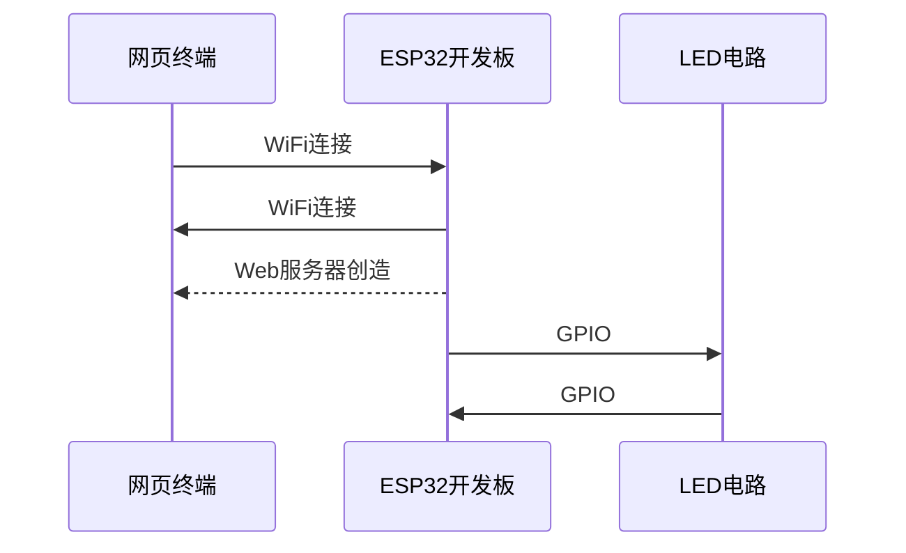
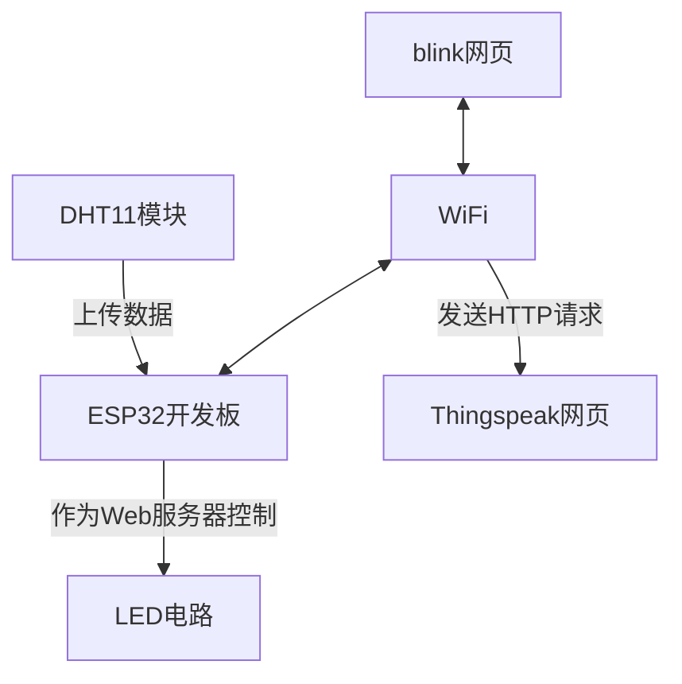

# 嵌入式工作室IoT方向2025招新题成果
## round-1：基于ESP32开发板的远程LED控制系统
### 项目简介：基于物联网控制，通过ESP32的web服务器，在局域网内实现网页控制LED灯的亮灭
---
### 系统架构
#### 整体架构图

#### 技术栈
##### 硬件组件
* 主控芯片：ESP32 DEVKITV1

* 外设：发光二极管、220Ω电阻

* 连接：面包板、杜邦线、micro USB数据线

##### 软件技术
* 开发环境：Arduino IDE

* 编程语言：Arduino Framework（类似cpp）

* 网络协议：TCP/IP,HTTP/2

* 核心库：WiFi、Webserver
---
### 实现思路（过程）

#### 环境搭建
1. 在Arduino官网上找到并安装IDE  
2. CSDN上寻找ESP32管理器地址，添加到IDE中  
3. 官网上找到并安装CP2102转串口驱动器  
#### 点亮第一盏灯
1. 数据线连接开发板与电脑  
2. 在Arduino中找到并连接开发板(ESP32 Dev Module)  
3. 打开文件-示例-Basics-Blink  
4. 修改引脚号，使其能匹配实际连接的引脚  
5. 选择上传，成功运行，板载LED开始闪烁  
6. 将开发板、电阻、发光二极管在面包板上连接，成功使外接LED开始闪烁
#### 连接到互联网
1. 在B站上找到相关学习资源（关键词：物联网入门、ESP32 Arduino教程，并选择性学习相关知识（TCP/IP协议、串口通信、WiFi库函数）  
2. 在Arduino上编写代码，上传  
3. 打开手机热点显示esp32已连接，在串口监视器中成功打印出IP地址
#### 构建Web遥控器
1. 在上一步找到的学习资源中学习WebServer库内容，并以WebServer示例中的HelloServer作参考  
2. 学习最基础的HTML知识以搭建网页  
3. 在面包板上连接开发板、LED与电阻 
4. 编写代码，上传至开发板  
5. 将开发板与手机连上同一热点，打印出IP地址  
6. 手机浏览器输入IP地址进入网页，点击网页中的开关按钮，实现LED的亮灭
#### 问题与解决
|遇到的问题|原因分析|解决方法|
| :---: | :---:| :---:|
|开发板无法与Arduino连接|未正确安装驱动|将CH340改为CP2102|
|连接后无法编译Blink程序|示例程序中引脚号不匹配|将示例中LED_BUILTIN替换为2|
|外接LED的两引脚插在面包板同一行时，无法点亮|可能是LED被面包板内金属条短路|改为插在同一列不同行|
|串口监视器无法打印出IP地址|代码中不含等待WiFi连接部分，没连上便打印，自然没有IP地址|修改代码，增加判断WiFi是否连接的语句|
|浏览器输入IP地址后无法进入网页|配置网页的函数中没有send语句，无法响应|函数末尾加上server.send(200,"text/html",html);


#### 核心代码展示
```c
#include<WiFi.h>
#include<WebServer.h>

const char * ssid = "blablabla";
const char * password = "blablabla";

WebServer server(80);

const int led = 4;//设置引脚为GPIO4

void handleroot()//配置网页
{
  String html = "<html><body><h1>Control the LED!</h1>";
  html += "<p><a href = \"/on\"><button>ON</button></a></p>";
  html += "<p><a href = \"/off\"><button>OFF</button></a></p>";
  html += "</body></html>";
  server.send(200,"text/html",html);
}
void ledon()//开灯
{
  digitalWrite(led,HIGH);
  server.send(200,"The LED is ON");
}

void ledoff()//关灯
{
  digitalWrite(led,LOW);
  server.send(200,"The LED is OFF");
}

void setup() {
  pinMode(led,OUTPUT);
  Serial.begin(115200);

  WiFi.begin(ssid,password);

  while(WiFi.status()!=WL_CONNECTED)//等待WiFi连接
  {
    delay(500);
    Serial.print(".");
  }
  Serial.println(" ");
  Serial.println("connected");
  Serial.print("the IP is:");
  Serial.println(WiFi.localIP());//打印出IP地址

  server.on("/",handleroot);//路径与函数建立关联
  server.on("/on",ledon);
  server.on("/off",ledoff);

  server.begin();//启动服务器
}

void loop() {
  server.handleClient();//持续处理请求
}

```
---
### 学习与收获
* 初步掌握了ESP32的GPIO通信、外设驱动
* 学会了嵌入式系统的基础调试方法与工具使用

* 初步理解了HTTP、TCP/IP通信协议
---
### 后续完善规划
* 实现网页端的自动刷新，从而不必每次开关灯后手动返回

* 与云端连接，使得控制开关突破局域网的限制

---
## round-2:基于ESP32开发板的多任务并发处理与云端监测系统
### 项目简介：在一轮的基础上，抛弃简单粗暴的 delay() 延时，学习并发处理的思维。最终同时实现网页控制LED亮灭，以及传感器收集环境数据；把数据上传到公共云平台，让设备真正融入“物联网”。
---
### 系统架构
#### 整体架构图

#### 技术栈
##### 硬件组件
* 主控芯片：ESP32 DEVKITV1

* 外设：发光二极管、220Ω电阻、DHT11传感器

* 连接：面包板、杜邦线、micro USB数据线

##### 软件技术
* 开发环境：Arduino IDE

* 网页应用：git,github,Thingspeak

* 编程语言：Arduino Framework（类似cpp）

* 网络协议：TCP/IP,HTTP/2

* 核心库：WiFi、Webserver、HTTPClient、DHT11
---
### 实现思路
* 非阻塞编程：使用```millis()```方法检查是否达到指定时间，以条件判断代替了强制延时。配合循环函数使用，每个任务触发时间点错开，在相邻的闪烁期间内其他功能仍可正常运行。  
代码示例：
```cpp
const unsigned long interval_re = 2000;//读取数据的时间间隔
const unsigned long interval_wr = 5000;//打印数据的时间间隔
unsigned long previoustime_dhtread = 0;
unsigned long previoustime_dhtwrite = 0;
int temp,humid;
void loop() {
  server.handleClient();//ESP32服务器持续处理请求
    unsigned long currenttime = millis();

  if(currenttime-previoustime_dhtread >= interval_re)
  {
  dht11.readTemperatureHumidity(temp,humid);
  previoustime_dhtread = currenttime;
  }
  if(currenttime-previoustime_dhtwrite >= interval_wr)
  {
    Serial.print("humidity:");
    Serial.print(humid);
    Serial.println("%");
    Serial.print("temperature:");
    Serial.print(temp);
    Serial.println("°C");
    previoustime_dhtwrite = currenttime;
  }
  if(currenttime-previoustime_http >= interval_http)
  {
    httpprocess(temp,humid);
    previoustime_http = currenttime;
  }
}
```
* 数据上云  
  1. 使用**Thingspeak**平台，因为其简单易上手，适合初学者。
  2. 使用**HTTPClient库**，让ESP32作为HTTP服务器连接传感器与网页，通过```GET()```请求实现传感器收集的数据传入云端。

* 打印json格式
  1. 对json的理解：由键值对组成的数组，键为字符串格式，值可为其他格式，键与值之间用冒号隔开（类似Python中的字典）。用于存储和交换数据。

  1. 采用字符串拼接方法创造出json格式的温湿度与LED亮灭数据。

  2. 调用Webserver库中的```send```以及```on()```函数将json路径与json字符串建立关联
---
### 学习与收获
* 学会了多任务并发处理的思想，提高了任务的处理效率。

* 初步学会了用git管理项目，使得任务完成更加稳定与系统化。

* 将数据传输到云端，第一次接触到真正的物联网。
---
### 后续完善规划
* 将展示Json部分用Arduinojson库改写，使代码更加优雅

* 实现网页端的自动刷新，从而不必手动返回

---
## 致谢
* <strong>感谢嵌入式工作室的全体前辈，你们点燃了我对嵌入式开发的兴趣。  

* 感谢IoT方向的前辈，你们的任务安排详尽合理，问题指导深入热情，为我提供了重要的帮助。</strong>

* 感谢bilibili贡献的学习资源。

* 感谢deepseek为我一次又一次解释长串报错信息。

* 感谢我自己坚持完成了招新挑战（虽然不那么完美）。限于时间，我并没有拓展学习太多招新要求以外的知识。希望自己再接再厉，努力追赶，培养出完善的能力，成为光荣的工作室成员。
---
## 附github仓库链接
https://github.com/Zeta-Chung/IoT-recruitment-Zeta_Chung
## 附Thingspeak链接
https://thingspeak.mathworks.com/channels/3172760/private_show